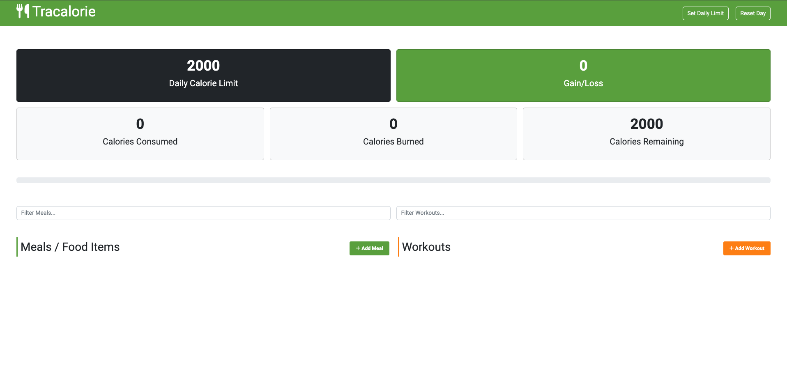
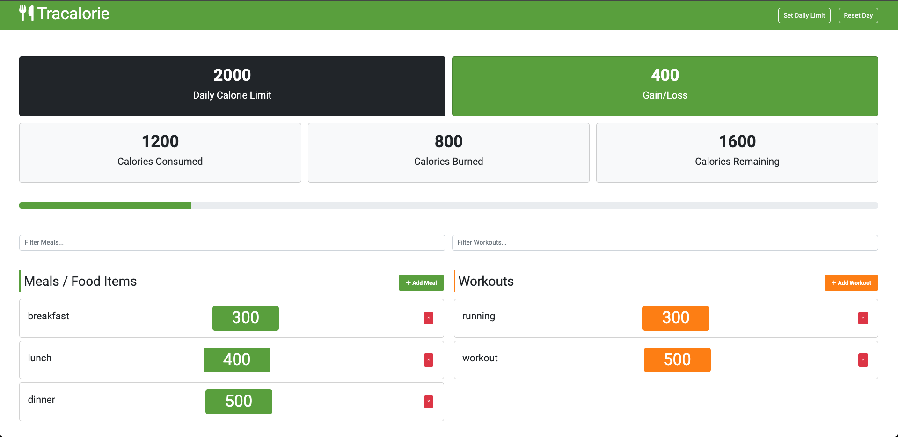

## Track Calorie App

The Track Calorie App is a simple web application that allows users to track their daily calorie intake. It is built using HTML, CSS, and JavaScript, and utilizes the Bootstrap framework for styling. The app also uses Font Awesome for icons and web fonts.

## Project directory structure

The project directory structure is as follows:

    css
        bootstrap.css
        fontawesome.css
        style.css
    .map
        favicon.ico
        index.html
    js
        app.js
        bootstrap.bundle.min.js
    webfonts
        fa-brands-400.ttf
        fa-brands-400.woff2
        fa-regular-400.ttf
        fa-regular-400.woff2
        fa-solid-900.ttf
        fa-solid-900.woff2
        fa-v4compatibility.ttf
        fa-v4compatibility.woff2

## Project features

The Track Calorie App has the following features:

- User can input their daily calorie Limit
- User can add food items and their calorie count
- User can view their total calorie intake for the day
- User can view their remaining calorie limit for the day
- User can delete food items from their list
- User can edit the calorie count for a food item
- User can reset their daily calorie intake and start over
- User's data is saved and can be accessed on subsequent visits to the app
- User can switch between light and dark mode for the app's interface
- you can search the meals and workout by their name

  
  
